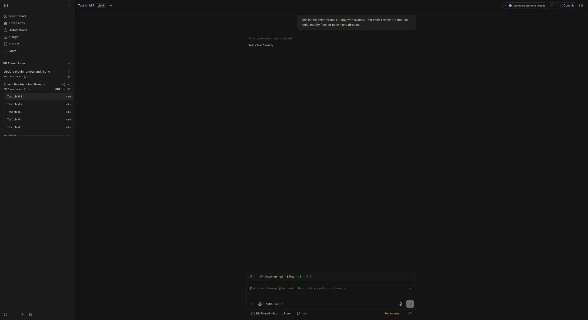
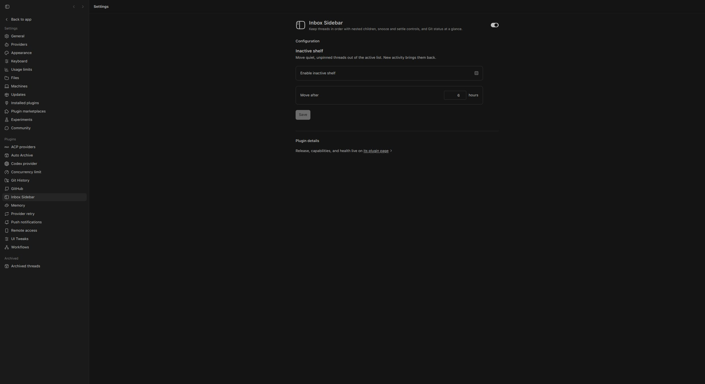

# Inbox Sidebar

[](https://github.com/wy3z/bb-plugin-thread-inbox/actions/workflows/ci.yml)

A compact inbox-style sidebar for BB with nested child threads, persistent
ordering, parking controls, provider marks, and Git metadata. It is a standalone
evolution of [T3 Sidebar](https://github.com/SawyerHood/bb-plugin-t3sidebar)
by [Sawyer Hood](https://github.com/SawyerHood).

## Features

- **Keep your place.** Drag pinned and inbox threads into a persistent order, or
  move the active thread with `Alt+Up` / `Alt+Down`. Status changes do not shuffle cards.
- **Follow delegated work.** Expand child threads beneath their parent, see
  descendant activity on the parent card, and jump between related threads from the header.
- **Clear the inbox without archiving.** Snooze for 30 minutes, 2 hours, 1 day,
  or 1 week, or settle a quiet thread into a collapsed shelf. Live descendant work
  prevents its parent from being parked.
- **Triage from the keyboard or touch screen.** Settle the open thread with
  `Ctrl+Alt+S`, including from the chat composer. Swipe a card left to settle or
  right to choose a snooze time.
- **See repository context at a glance.** Cards show the project, branch,
  working-tree state, PR number and state, and provider mark. Git indicators
  distinguish clean, untracked, uncommitted, and unmerged work.
- **Find and act on threads.** Filter by project, use BB sidebar search, rename
  inline, and multi-select for bulk snooze, settle, or archive.
- **Let quiet work step aside.** Enable an Inactive shelf with a configurable
  delay; new activity brings threads back. Pinned threads stay visible.

## Screenshots





## Install

```sh
bb plugin install git:https://github.com/wy3z/bb-plugin-thread-inbox.git@^0.2.2
```

Select **Inbox Sidebar** under **Settings → Appearance → Sidebar**. Update a
stable installation with:

```sh
bb plugin update thread-inbox
```

## Behavior

- Top-level threads keep a stable user-defined order instead of jumping around
  as their status changes.
- Parents collapse by default; opening or searching for a child expands its
  parent automatically.
- Live descendant work prevents the parent from being parked.
- Snooze offers presets for 30 minutes, 2 hours, 1 day, or 1 week.
- Snoozed, settled, and inactive groups remain in compact collapsed shelves
  until opened.

## Settle keyboard shortcut

Press **Ctrl+Alt+S** (Mac: **Control+Option+S**, not Command) to
settle the currently active/open thread. This targets that exact thread, not a
hovered row, selected batch, or a child's parent, and works independently of
project/search filtering while this sidebar is mounted. The active card's Settle
button exposes the binding in its tooltip and `aria-keyshortcuts`.

Only an unarchived thread on the active lifecycle shelf can be settled (including
a quiet thread in the Inactive group). Running/working-draft threads, pending
interactions, workflows, background agents/commands, plan mode, and goals block
the action, including activity in descendants. Already snoozed/settled threads
are left alone. Unread finished output alone does not block settling.

The shortcut works while typing in BB's chat composer without submitting or
clearing the draft. This narrow exception recognizes BB's
`[data-promptbox-editor-content] .ProseMirror[contenteditable="true"]` surface;
if BB changes that markup, it safely falls back to ignoring the editor.
Other inputs, textareas, selects, contenteditable fields, file editors, terminals,
menus and modal dialogs remain protected, as do handled events, IME composition,
AltGraph, and held-key repeats. Duplicate requests are suppressed while a settle
is pending; failures show a toast and permit retry.

SDK 0.4.21 has no public shortcut contribution API, so this uses a cleaned-up,
bubbling document listener rather than BB-private APIs. The binding is absent
from BB core's current default registry (including web/desktop and Mac variants),
does not overlap this plugin's Alt+Up/Down or selection shortcuts, and avoids
common browser and text-editing chords. It is not configurable in BB's keyboard
settings. Custom BB bindings, browser extensions, OS shortcuts, or future defaults
may conflict; avoid assigning this combination elsewhere. Eligibility uses the
latest sidebar snapshot, not an atomic server-side activity check; subsequent
live work/attention brings parked threads back through the existing lifecycle.

MIT licensed; see [LICENSE](LICENSE).
